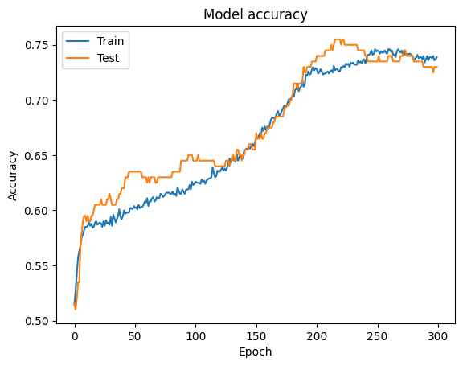
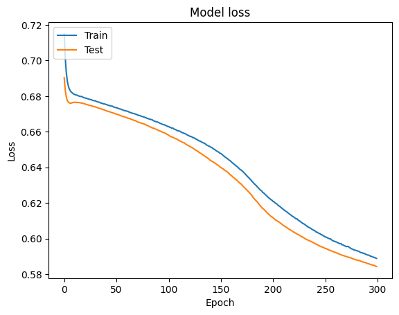
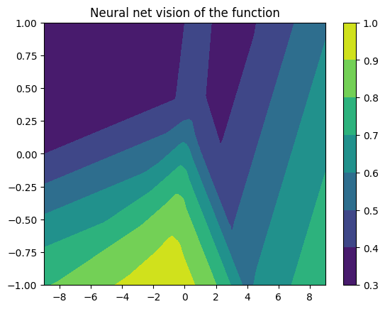
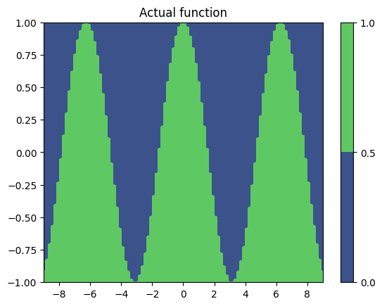
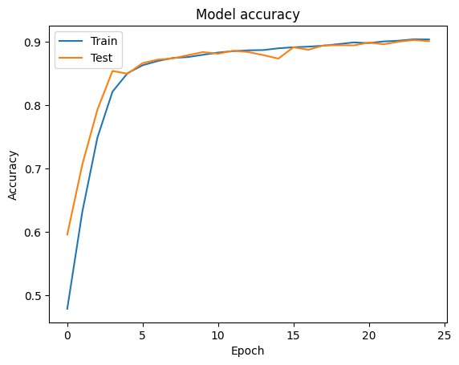
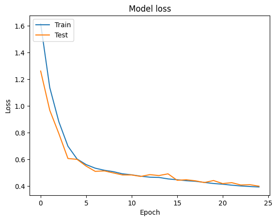

# Labarotory work №4
**student:** Shcherbakov Alexander Valerievich\
**teacher:** Koroleva Yuliya Aleksandrovna\
**variant:** 2 (isu 31219**2**)

|var|part1 func|part2 data|Hyperparameters|
| --- | --- | --- | --- |
| 2 | cos(x), X:-9..9, Y:-1..1| CIFAR100 | Learn rate, L1 |

### Purpose of work
Study of the hyperparameters of the neural network, understanding impact of different hyperparameters on accuracy.

### Task
There are 2 parts of work in files named Lab1-Part1 and Lab1-Part2 respectively. Both parts represent work with collections of training and test data. \
**Part 1** represent recognition of basic math functions with illustrations of neural net vision of the functions for training.\
**Part 2** represent recognition of simple images for making following work.
Data usage represented at https://keras.io/datasets/ and depends on variant.

Fashion articles
Layer activation type, loss function type

There are represented such hyperparameters as
- Layer count
- Neurons count per layer (actually it’s not hyperparameter but structure parameter)
- Learn rate
- Regularization L1 and L2
- Output layer activation type
- Layer activation type
- Loss function type
- Epoch count

1) By changing these hyperparameters try to reach max accuracy value(at least 0.95)  for Part2 model with fixed epoch count 20
2) Change 1st hyperparameter’s value from min to max with minimal step depends on your variant 
3) Show impact on result using graphs
4) Describe impact of each hyperparameter on accuracy.
5) Set hyperparameter value back to one which produced max accuracy
6) Repeat 2-5 steps for second hyperparameter

Make a report including:
- Each hyperparameter description and its impact on accuracy.
- Hyperparameters’ values which were used to reach accuracy value 0.95
- Graphs for these hyperparameters’ values

## Result

plots for parameters
### Part1
| Learn rate | L1 |
|---|---|
| 0.001 | 0.0005 |

accuracy: 0.7300000190734863

### Part2

plots for parameters
| Learn rate | L1 |
|---|---|
| 0.01 | 0.0001 |

accuracy: 0.91

